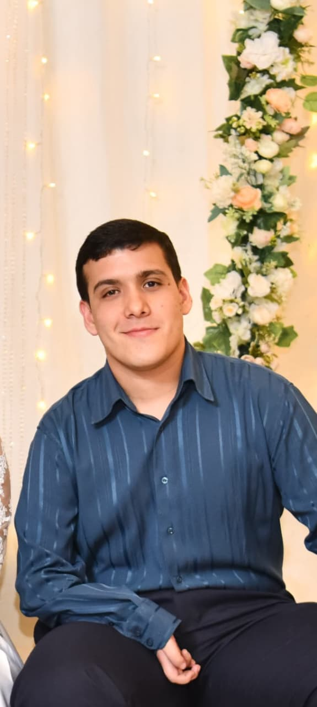

  
  
  # Marcos Natanael Da Silva
  **Analista de Sistemas | Desarrollador Full Stack (Laravel/React)**  
  📍 Argentina, Misiones | 🌐 Disponibilidad Remota Inmediata  
  📧 marcos.dasilva@ejemplo.com | 📱 +54 9 XXX XXX-XXXX  
  🔗 [LinkedIn](https://linkedin.com/in/marcosdasilva) | 🐙 [GitHub](https://github.com/Marcos2497) | 🚀 [Portfolio](https://marcos-dasilva.vercel.app)

---

## 👨‍💻 Perfil Profesional
Analista de Sistemas graduado (2025) con especialización en desarrollo full stack utilizando **Laravel y React** como stack principal. Combino sólidos conocimientos en ingeniería de software con experiencia práctica en el ecosistema PHP moderno y JavaScript. Busco oportunidad remota como **Desarrollador Laravel** o **Full Stack** donde pueda aportar valor desde el día uno mientras continúo perfeccionando mis habilidades.

**💼 Stack Principal:** Laravel | React | Node.js | PostgreSQL | Docker  
**🌍 Idiomas:** Español (Nativo), Portugués (Fluido), Inglés (Básico - Aprendiendo)  
**🎯 Disponibilidad:** Remoto Full-time | Contrato formal | Inicio inmediato

## 🛠️ Stack Tecnológico Especializado

### **Backend & APIs (Especialidad PHP)**
- **Laravel 10/11:** Eloquent ORM, Migrations, Blade, Artisan, Queues
- **PHP 8+:** Programación orientada a objetos, patrones de diseño, Composer
- **APIs REST:** Laravel Sanctum, API Resources, Form Requests, Validation
- **Node.js:** Express.js, REST APIs, middleware, error handling
- **Python:** FastAPI, Flask, scripts de automatización

### **Frontend & UI/UX**
- **React.js 18:** Hooks, Context API, React Router, Componentes funcionales
- **Next.js 14:** App Router, Server Components, TypeScript, Optimización
- **TypeScript:** Tipado estático, interfaces, generics, type safety
- **Tailwind CSS:** Utility-first, responsive design, componentes personalizados
- **HTML5/CSS3:** Semántica, accesibilidad, layouts modernos

### **Bases de Datos & Almacenamiento**
- **PostgreSQL:** Relaciones complejas, índices, consultas optimizadas
- **MySQL:** Experiencia en proyectos legacy y Laravel tradicional
- **MongoDB:** Schemaless design, agregaciones, proyectos MERN
- **Eloquent ORM:** Relaciones, scopes, accessors/mutators, eager loading
- **Redis:** Cache, session storage, queues (Laravel Horizon)

### **DevOps & Herramientas**
- **Docker & Docker Compose:** Entornos de desarrollo consistentes
- **Laravel Sail:** Desarrollo local simplificado para Laravel
- **Git & GitHub:** Git flow, pull requests, CI/CD básico
- **Testing:** PHPUnit, PestPHP, Jest, React Testing Library
- **APIs Tools:** Postman, Insomnia, Swagger/OpenAPI

## 🎓 Educación

### **Analista en Sistemas de Computación** | *Graduado 2025*
**Universidad Nacional de Misiones (UNaM)** | Apóstoles, Misiones  
- **Proyecto de graduación:** "Sistema de Logística de Alimentos para Cooperativa Frigorífica"
- **Stack utilizado:** Laravel 10, React 18, PostgreSQL, Docker
- **Calificación:** 9/10 - Reconocimiento por innovación técnica
- **Enfoque:** Desarrollo web empresarial, bases de datos, arquitectura software

### **Licenciatura en Sistemas de Información** | *Último año (En curso)*
**Universidad Nacional de Misiones (UNaM)**  
- **Cursos relevantes:** Ingeniería de Software, Bases de Datos Avanzadas, Redes
- **Especialización:** Arquitecturas web modernas, patrones de diseño
- **Proyectos:** Desarrollo de sistemas empresariales escalables

## 💼 Experiencia Técnica

### **Desarrollador Full Stack - Proyecto de Graduación** | *2024-2025*
**Sistema de Logística para Cooperativa Frigorífica**

- **Arquitectura:** Laravel 10 (Backend API) + React 18 (Frontend SPA)
- **Base de datos:** PostgreSQL con relaciones complejas
- **Features implementadas:**
  - Sistema de autenticación con roles (admin, supervisor, operador)
  - Gestión de inventario con control de stock en tiempo real
  - Módulo de rutas y distribución con optimización básica
  - Generación de reportes PDF/Excel con Laravel Excel
  - Dashboard administrativo con métricas y gráficos
- **Tecnologías:** Laravel Sanctum (JWT), Eloquent ORM, React Query, Chart.js

### **Técnico Informático** | *Data Center Universitario - 2023-Presente*
**Universidad Nacional de Misiones**

- Administración y mantenimiento de infraestructura de red LAN
- Soporte técnico en laboratorios de computación (100+ equipos)
- Resolución de incidencias hardware/software
- **Habilidades desarrolladas:** Troubleshooting, networking basics, atención al usuario

### **Práctica Profesional - Auditoría Informática** | *UNaM - 2023*
- Auditoría de seguridad en dos laboratorios universitarios
- Evaluación de políticas de acceso, backup procedures
- **Entregable:** Informe técnico con 15+ recomendaciones de mejora

## 🚀 Proyectos Técnicos

### **📦 Sistema E-commerce Laravel** | *Proyecto Personal*
**Stack:** Laravel 11, Livewire, Alpine.js, Tailwind, MySQL
- Carrito de compras con sesiones persistentes
- Integración API MercadoPago para procesamiento de pagos
- Panel administrativo con CRUD completo de productos
- Sistema de reseñas y ratings de usuarios
- **GitHub:** [Ver repositorio](#)

### **🔌 Monitoreo IoT Energético** | *Proyecto Académico*
**Stack:** Python (FastAPI), React, MQTT, MongoDB
- Sistema de monitoreo en tiempo real de consumo energético
- Dashboard con visualización de datos de sensores simulados
- Arquitectura pub/sub con broker MQTT
- **Aprendizajes:** IoT patterns, data streaming, WebSockets

### **🏋️ Sistema de Gestión de Gimnasio** | *Full Stack Project*
**Stack:** Node.js, Express, React, MongoDB
- Tracking de progreso físico de clientes
- Historial de entrenamientos y métricas personales
- Sistema de reserva de turnos para clases
- **Focus:** UX intuitiva, data visualization, mobile-responsive

## 🔬 Conocimientos Específicos Laravel

### **Ecosistema y Mejores Prácticas**
- **Patrones:** MVC, Repository Pattern, Service Classes, DTOs
- **Eloquent Avanzado:** Polymorphic relationships, query scopes, model events
- **API Design:** RESTful principles, versioning, pagination, filtering
- **Security:** CSRF protection, XSS prevention, SQL injection protection

### **Packages y Herramientas Comunes**
- **Spatie:** Laravel Permission, Media Library, Activity Log
- **Laravel Excel:** Import/export de datos masivos
- **Laravel DomPDF:** Generación de documentos PDF
- **Socialite:** Autenticación con OAuth providers
- **Telescope:** Debugging y monitoring en desarrollo

### **Performance & Optimización**
- **Cache Strategies:** Redis para queries frecuentes
- **Query Optimization:** Eager loading, database indexing
- **Queue Management:** Laravel Horizon para monitoreo de jobs
- **Asset Optimization:** Laravel Mix, Vite integration

## 🌍 Idiomas y Habilidades Blandas

| Idioma | Nivel | Detalles |
|--------|-------|----------|
| **Español** | 🟢 Nativo | Lengua materna, comunicación técnica y business |
| **Portugués** | 🔵 Fluido | Comprensión nativa, comunicación efectiva profesional |
| **Inglés** | 🟡 Básico (A2) | Comprensión de documentación técnica, en estudio activo |

**💪 Habilidades Blandas:**
- **Autodidacta:** Aprendo rápidamente nuevas tecnologías
- **Proactivo:** Identifico y resuelvo problemas antes de que escalen
- **Responsable:** Cumplimiento de plazos y compromisos
- **Trabajo en Equipo:** Experiencia en proyectos colaborativos
- **Comunicación:** Explicación clara de conceptos técnicos

## 🎯 Objetivo Profesional

Busco mi primera posición como **Desarrollador Laravel Junior** o **Full Stack Developer** en empresa que valore:

- **Stack Moderno:** Laravel + React/Next.js + TypeScript
- **Cultura Técnica:** Code reviews, pair programming, mentoría
- **Crecimiento:** Oportunidades de aprendizaje y certificaciones
- **Remoto:** Equipo distribuido con buena comunicación

**Interés especial en:**
- Empresas SaaS o product companies
- Startups con crecimiento acelerado
- Equipos que usen Laravel como framework principal
- Proyectos con impacto real en usuarios

## 📍 Disponibilidad y Condiciones

- ✅ **Modalidad:** Remoto 100% (Full-time)
- ✅ **Tipo de Contrato:** En relación de dependencia o contractor
- ✅ **Jornada:** 40 horas semanales, horario flexible
- ✅ **Inicio:** Disponibilidad inmediata (máximo 15 días de preaviso)
- ✅ **Salario:** Acorde al mercado para posición junior en LATAM/España
- ✅ **Beneficios deseables:** Capacitaciones, equipamiento, días de estudio

---

### **📞 Contacto Directo**

**Email:** mmarcosnatad@gmail.com  
**Teléfono:** +54 3574-435958
**Portfolio:** [https://marcos-dasilva.vercel.app](https://marcos-dasilva.vercel.app)  
**GitHub:** [github.com/Marcos2497](https://github.com/Marcos2497)  
**LinkedIn:** [linkedin.com/in/marcosdasilva](https://linkedin.com/in/marcosdasilva)

📄 **Descargar PDF:** [CV_Marcos_Da_Silva.pdf](CV_Marcos_Da_Silva.pdf)  
🌐 **CV Online:** [marcos2497.github.io/CV---DS/](https://marcos2497.github.io/CV---DS/)

*Última actualización: Enero 2025 - CV diseñado para ATS y lectura humana*